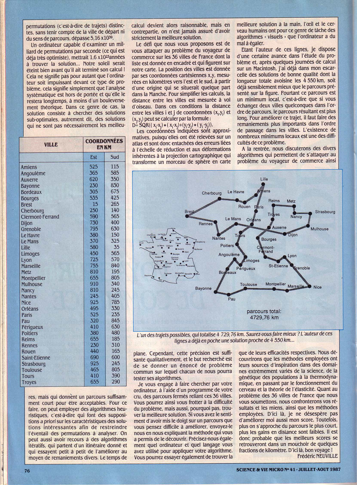

# Salesman

# Le problème
Année 1987. SVM publie un problème dans son "Demandez le programme" :

 &nbsp; 

Il s'agit pour un voyageur de commerce du parcourir un ensemble de 36 villes françaises avec la distance la plus courte.

# Une solution
1. Création d'un graphe en regroupant les villes les plus proches afin de limiter le nombre de chemins et faciliter la recherche.
2. Trouver un [circuit hamiltonien](https://fr.wikipedia.org/wiki/Graphe_hamiltonien).
3. Améliorer le chemin résultant du circuit précédent grace à l'algorithme [2-opt](https://fr.wikipedia.org/wiki/2-opt).
4. Répéter le point 2 en gardant le chemin le plus court.
